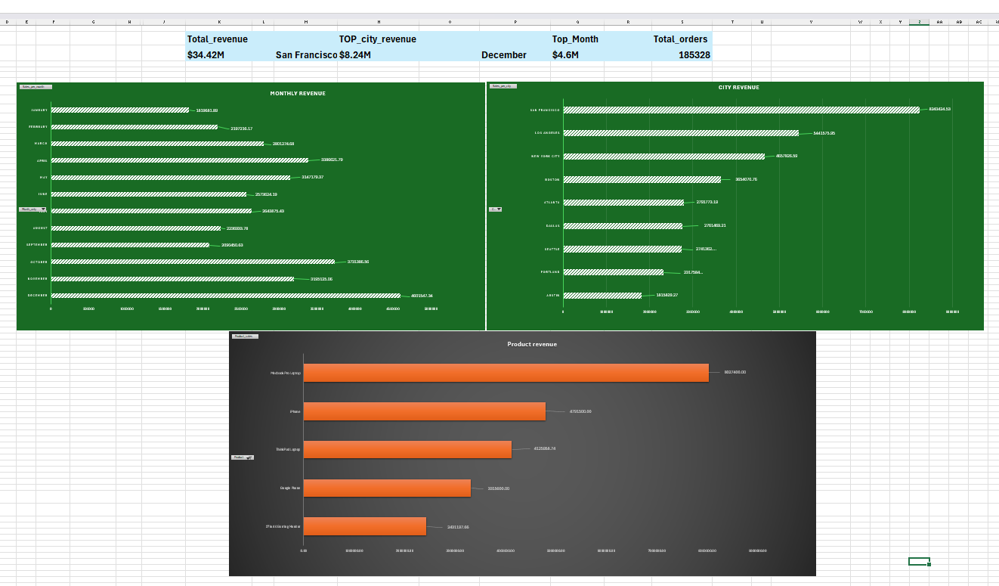

# Sales Data Analysis Project

## Project Overview

This project analyzes retail electronics sales data sourced from Kaggle using Excel and SQL to identify revenue trends, top-performing products, top-performing cities, customer purchasing patterns, and business opportunities.

The project covers the complete data analysis workflow:

* Data Cleaning
* Duplicate Detection and Removal
* Feature Engineering
* Exploratory Data Analysis (EDA)
* KPI Development
* Interactive Dashboard Creation
* SQL-Based Business Analysis
* Business Insight Generation

The analysis was performed on 185,328 sales records and produced insights into revenue performance across products, cities, months, days, and customer purchasing hours.

## Tools Used

* Microsoft Excel
* Pivot Tables
* Pivot Charts
* Dashboard Design
* MySQL Workbench
* SQL(Data Import, Database Management)

  ## Dashboard Preview

The dashboard was designed to provide a quick overview of business performance through KPI cards and analytical charts.

### KPI Cards

- Total Revenue: $34.42M
- Highest Revenue City: San Francisco ($8.24M)
- Highest Revenue Month: December ($4.60M)
- Total Orders: 185,328

## Dashboard Components
Revenue Analysis
Revenue by Month
Revenue by City

## Dashboard

---

## Key Metrics

Metric	                                  Value
Total Revenue	                       $34.42M
Highest Revenue City	               San Francisco ($8.24M)
Highest Revenue Month	               December ($4.60M)
Total Orders	                       185,328
Highest Revenue Product	             MacBook Pro Laptop ($8.02M)
Highest Units Sold Product	         AAA Batteries (4-pack) - 30,880 Units
Helper Columns Added (5)             Date Only, Year Only, Month Only, Quarter Only, Day Only

## Key Business Insights

1. Seasonal Revenue Peak

December generated the highest monthly revenue at $4.60M, driven by holiday shopping and festive demand.

2. Strongest Market

San Francisco generated the highest city revenue at $8.24M, indicating strong customer demand and purchasing power.

3. Product Performance

MacBook Pro Laptop generated the highest product revenue at $8.02M despite selling fewer units than low-cost accessories.

4. High-Volume Products

AAA Batteries (4-pack) recorded the highest units sold at 30,880 units, highlighting the importance of maintaining inventory for frequently purchased products.

5. Peak Customer Activity

Customer purchasing activity peaked during 12 PM and 7 PM, making these ideal times for promotional campaigns and customer engagement.

6. Day-Wise Revenue Trend

Tuesday generated the highest day-wise revenue at $5.08M, with strong revenue performance maintained throughout the week.

## Skills Demonstrated

Data Cleaning
Duplicate Detection
Feature Engineering
Exploratory Data Analysis (EDA)
Pivot Tables
Pivot Charts
Dashboard Design
KPI Development
Business Analysis
SQL Data Import
SQL Aggregations
GROUP BY
COUNT(DISTINCT)
Date Functions (MONTHNAME, DAYNAME)
Data Validation
Documentation

## Project Outcome

** This project successfully transformed raw sales transaction data into actionable business insights through Excel dashboards and SQL analysis. The findings highlighted key revenue drivers, customer purchasing patterns, top-performing products, and high-value markets, enabling data-driven  business decision-making.
